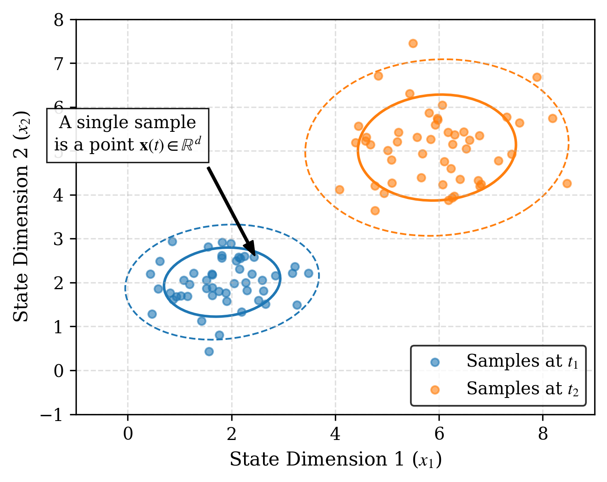
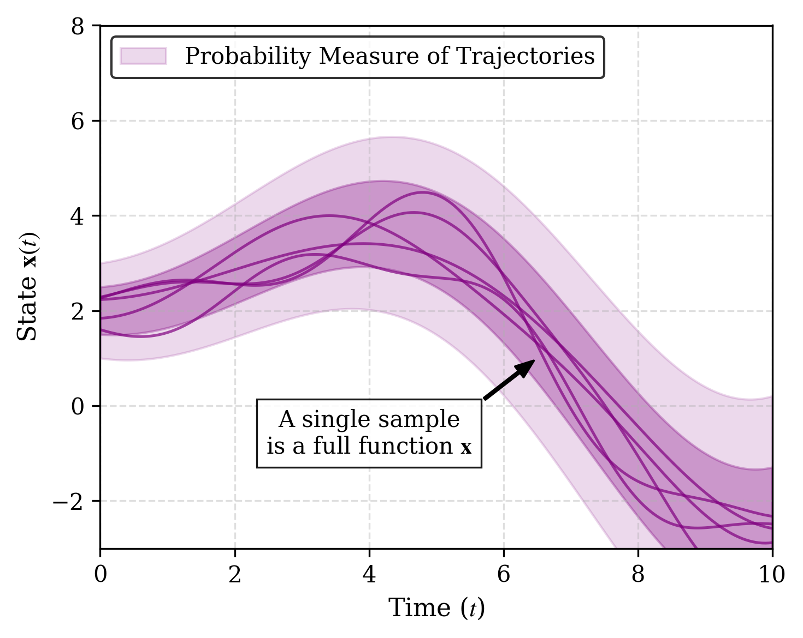
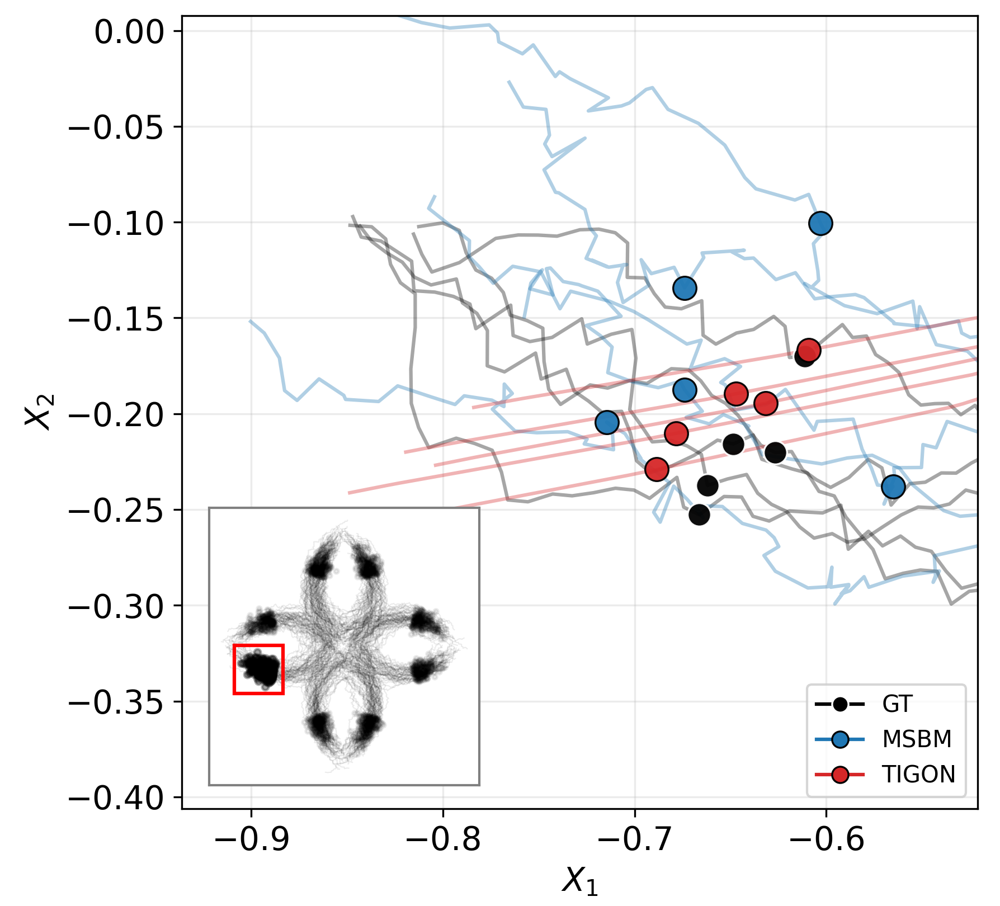

# FKL — Functional KL Divergence Estimation

> *Relative Entropy Estimation in Function Space: Theory and Applications to Trajectory Inference*

> WANG Chao\*, NEPOTE Luca\*, FRANZESE Giulio, MICHIARDI Pietro

> \* Equal contribution

> 📄 **Paper:** [arXiv:2604.20775](https://arxiv.org/abs/2604.20775)

This repository implements **FKL**, a tractable estimator of the Kullback–Leibler divergence between probability measures on **function space**, together with the experiments from the paper.

## Why function space?

Trajectory Inference (TI) reconstructs dynamical processes from time-indexed snapshots $\mu_{t_1}, \dots, \mu_{t_T}$. Because measurements are usually destructive (e.g. single-cell sequencing), individual particles cannot be tracked longitudinally, and methods are typically evaluated with **marginal** metrics ($W_2$, MMD, …) on held-out time-points.

**The problem:** marginal metrics are blind to the *temporal coupling* between snapshots. Infinitely many path measures are consistent with the same finite set of marginals — so two methods can produce **identical marginals but qualitatively different trajectories**, and marginal scores rank them inconsistently.

<p align="center">
  
  &nbsp;&nbsp;
  
</p>

<p align="center">
  <em>Left: snapshot-based metrics compare marginals independently at each <span>&tau;</span>. Right: a functional metric compares full path measures, taking temporal coupling into account.</em>
</p>

## The FKL estimator

We treat path measures as first-class citizens and estimate the KL divergence directly between trajectory distributions $\nu^A$ and $\nu^B$.

Using **Functional Flow Matching (FFM)** with the linear interpolant $X_t = (1-t) X_0 + t X_1$ and $\mu_t = \mathrm{Law}(X_t)$, we train class-conditional velocity fields $v^A_t$ and $v^B_t$ and obtain

$$
\mathrm{FKL}(\nu^A \Vert \nu^B) = \int_0^1 \int_{\mathcal{H}} \frac{t}{1-t} \Vert v^A_t(x) - v^B_t(x) \Vert^2_{\mathcal{H}_{\mu_0}} d\mu^A_t(x) dt
$$

where the norm is the Cameron–Martin norm associated with the trace-class noise covariance $C$. In practice the divergence is estimated by Monte Carlo:

1. Sample $x_1^A \sim \nu^A$, $t \sim \mathcal{U}[0,1]$, $x_0 \sim \mathcal{N}(0, C)$.
2. Form the interpolation $x_t^A = t \cdot x_1^A + (1-t) \cdot x_0$.
3. Accumulate $\dfrac{t}{1-t} \Vert v^A_\theta(x_t^A) - v^B_\theta(x_t^A) \Vert^2_{C^{1/2}}$.
4. Average over samples; repeat with $A$ and $B$ swapped for the reverse KL.

The velocity fields are parametrized by a **Mesh-Informed Neural Operator (MINO-T)**, which makes the estimator **resolution-invariant**.

## Non-identifiability problem

On the synthetic **Petal** dataset at $\tau = 0.75$, MSBM and TIGON achieve nearly identical $W_2$ scores, yet generate qualitatively different trajectories — only FKL distinguishes them:

<table>
<tr>
<td width="54%" align="center">
  
</td>
<td width="44%" align="center">

| Method | $W_2$ | $\mathrm{KL}(\nu^A \Vert \nu^B)$ | $\mathrm{KL}(\nu^B \Vert \nu^A)$ |
|---|---|---|---|
| MSBM  | 0.160 | **9.641**  | **17.055** |
| TIGON | **0.155** | 96.144 | 35.505 |

</td>
</tr>
</table>

MSBM and TIGON tie on the marginal metric but FKL exposes a large gap in the underlying *dynamics*.

## Setup

Create the conda environment:

```bash
conda env create -f requirement.yaml
conda activate fkl_muon
```

A CUDA-capable GPU is required to run the experiments end-to-end.

## Notebooks (end-to-end experiments)

Tutorial notebooks live in `notebooks/`. Each runs a full experiment: data visualization, training, KL estimation, and result inspection.

| Notebook | Dataset | Config | Data dir | Grid (M) | Dims (D) |
|---|---|---|---|---|---|
| `tutorial_gm.ipynb`   | Gaussian Mixture          | `configs/gm.yaml`   | `data/GM/`   | 128 | 1 |
| `tutorial_eb.ipynb`   | Embryoid Body             | `configs/eb.yaml`   | `data/EB/`   | 101 | 5 |
| `tutorial_hesc.ipynb` | human Embryonic Stem Cell | `configs/hesc.yaml` | `data/HESC/` | 121 | 5 |

- **GM** compares two Gaussian measures (A vs B) — analytic KL is known, used to validate the estimator.
- **EB / hESC** compare a reference method (`sbirr`) against five alternatives (`vsb`, `msbm`, `mfl`, `am`, `tigon`).

### Running a notebook

1. Open the notebook in Jupyter or VS Code.
2. Set `GPU` in the configuration cell to your CUDA device index.
3. Run cells in order. Training logs and KL results are saved under `log/<dataset>/`.

## Project structure

```
FKL/
  configs/          # YAML experiment configs (eb, hesc, gm)
  data/             # Input trajectory data (.npy files)
  log/              # Training outputs and KL results (created at runtime)
  models/           # MINO-T and other model definitions
  notebooks/        # Tutorial notebooks
  scripts/          # Training and evaluation entry point (main.py)
  util/             # Utilities (plotting, checkpointing, etc.)
  functional_fm.py  # Functional flow matching implementation
  functional_kl.py  # KL divergence estimation
```

## Citation

If you find our paper useful, please cite:

```bibtex
@article{wang2026relative,
  title={Relative Entropy Estimation in Function Space: Theory and Applications to Trajectory Inference},
  author={Wang, Chao and Nepote, Luca and Franzese, Giulio and Michiardi, Pietro},
  journal={arXiv preprint arXiv:2604.20775},
  year={2026}
}
```

## License

This project is released under the [MIT License](LICENSE).
